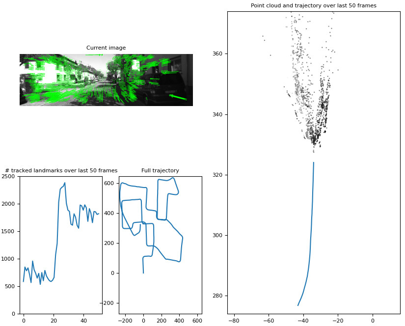

# VO GPU-CPU Comparison
This repository aims to show the difference of a monocular VO pipeline running on a GPU versus running on a CPU. On a high level the visual odometry is a achieved by detecting feature points in two subsequent images using the Lucas-Kanade OF tracker. Using the keypoint correspondance the Essential matrix can be estimated and then decomposed into the relative rotation and translation of the two frames. The rotation and translation is tracked globally, which can be used to get a trajectory which is defined up to scale.

## 1. Requirements
The pipeline has been tested with *Python 3.8.5*, but should be compatible with any 3.X.X version. Python requirements can be installed with `pip install -r requirements.txt`

### CUDA support
In order to run the pipline on a GPU a NVIDIA graphics card is required on the machine. Additionally OpenCV needs to be compiled with the `-D WITH_CUDA=O` flag. Python bindings for OpenCV can be conveniently installed with [this repository](https://github.com/skvark/opencv-python). The repository provides instruction for CUDA installation, but after updating the cmake target with the CUDA flag in the OpenCV submodule in this repository, the installation of CUDA should be already done.

## 2. Running the pipeline
The pipeline can be run with `python main.py -a <DATASET> -e <DETECTOR> -g <NO GPU=0, GPU=1>`. The available detectors are SURF, FAST, ORB, SHI-TOMASI corners and REGULAR_GRID. The available datasets are KITTI, Malaga, Parking and Autobahn.

### Datasets
The documentation of the dataset management can be found in `datasets/README.md`

